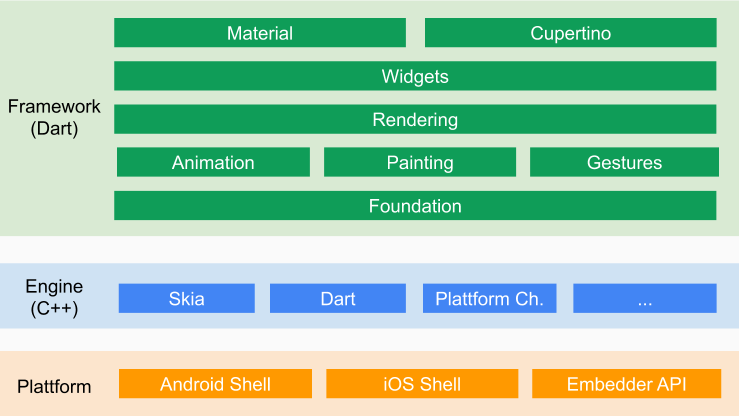
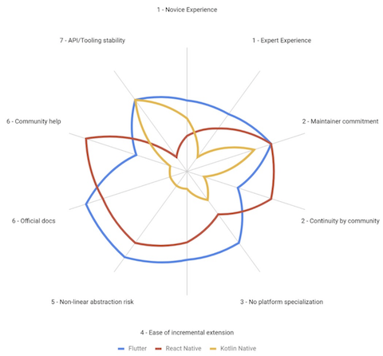

## Flutter 101

###### by Benny Ng

---

## about me

- coder, learner, teacher, father
- co-founded **42 Labs**, **F5 Works**
- build stuff for commercial & commnunity
- recent interests: **Flutter**, **NuxtJS**, **NestJS**, **Istio**

---

## overview

- released by Google in 2017
- cross platforms development kits
- code in language **Dart**
- render at **60 FPS**
- suitable for startups & enterprises

---

## Dart

- OOP
- static type
- single-threaded
- garbage-collected
- multi process (isolate)
- AOT and JIT

---

## architecture



---

## cross platforms

- iOS / Android / Fuchsia
- Mac / Windows
- web / Raspberry Pi
- Skia rendering engine (written in C++)

---

## community & prospect

- Github stars **~91k** _(Reative Native ~86k)_
- over **2 millions** developers
- **50,000** apps launched in all time
- **10,000** apps launched in **last month**
- adopters: Tencent, Stadia, Square, NuBank

---

## vs React Native

|          | Flutter    | React Native |
| -------- | ---------- | ------------ |
| Release  | 2017       | 2015         |
| Language | Dart       | JavaScript   |
| Github   | 91.2k ★    | 86.6k ★      |
| License  | Free (BSD) | Free (MIT)   |

Note:

- https://medium.com/airbnb-engineering/sunsetting-react-native-1868ba28e30a

---

## Developer eXperience

- IDE integration (VSCode, Android Studio) <!-- .element: class="fragment" data-fragment-index="1" -->
- built-in package manager <!-- .element: class="fragment" data-fragment-index="1" -->
- built-in hot restart, hot-reload <!-- .element: class="fragment" data-fragment-index="1" -->
- built-in debugger <!-- .element: class="fragment" data-fragment-index="1" -->
- built-in profiler <!-- .element: class="fragment" data-fragment-index="1" -->
- CodePen supports <!-- .element: class="fragment" data-fragment-index="1" -->
- no node_modules :) <!-- .element: class="fragment" data-fragment-index="6" -->

---

## UI Components

- rich official components
- Material Design, cupertino
- [Syncfusion](https://www.syncfusion.com/flutter-widgets)
- CodePen

---

## CI / CD

- strong CLI tools
- single command build binary
- Fastlane support

---

## adopter NuBank

- fintech, 10B value, 2000+ employers
- adopted Flutter in 2019
- specialists don't scale well
- culture fit (learn until die)
- less fragile for breaking changes

---

## adopter NuBank



---

## demo time

Note:

- switch to example in VS code
- make some changes on example

---

## enable Flutter web

```sh
$ flutter channel beta
$ flutter upgrade
$ flutter config --enable-web
$ flutter create .
$ flutter devices
$ flutter run -d chrome
```

---

#### web live demo

<iframe frameborder="0" width="256" height="512" src="https://flutter-101.surge.sh/#/"></iframe>

https://flutter-101.surge.sh/#/

---

## more...

- state management
- animation (canvas, shder)
- theming
- native hardware integrate (Channel)
- channel (stable, beta, dev, master)
- multi-processing (isolate)

---

## wait a sec

- framework code bumped up app size
- Dart still young
- Codes is very verbose
- Flutter still young
- web is beta only
- resources in Chinese
- chances Google abandon it

---

## references

- https://flutter.dev/
- https://flutter.github.io/gallery/
- https://flutterx.com/
- https://dart.dev/guides/language/effective-dart

---

## Q & A

---

## keep in touch

- benny.ng@gmail.com
- https://github.com/bennyng
- https://twitter.com/hin556
